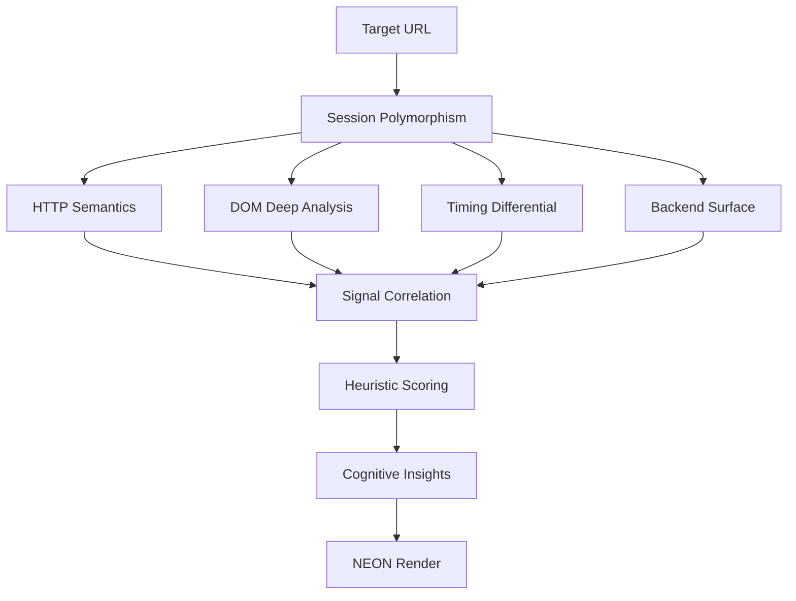

<p align="center">
  
</p>

<p align="center">
  
</p>

<p align="center">
  
  
  
</p>

<p align="center">
  
  
  
</p>

<p align="center">
  
</p>
<p align="center">
  
</p>


---

# 🧬 OsintSignalsF  
### Neon Alchemical Mode — Surgical Intelligence Engine

> **“La verdadera inteligencia no ataca: interpreta.”**  
> — ByMakaveli · New Era

---

## 🌌 ¿Qué es OsintSignalsF?

**OsintSignalsF** es un **motor de inteligencia forense semántica** diseñado para analizar **superficies web y backend** de forma **quirúrgica, elegante y no intrusiva**.

No es un scanner ruidoso.  
No es un exploit tool.  
No es fuerza bruta.

👉 Es **lectura cognitiva de señales**.

OsintSignalsF observa **cómo responde un sistema**, **cómo varía**, **cómo respira**, y a partir de eso **infiere arquitectura, complejidad y riesgo**.

---

## 🎯 ¿Para qué sirve?

OsintSignalsF sirve para:

- 🔬 **Análisis forense web avanzado**
- 🧠 **Comprensión real de backends modernos**
- 🧩 **Identificación de lógica no documentada**
- 🛡️ **Auditorías de seguridad éticas**
- 🧪 **Research técnico y educativo**
- 🧭 **Preparación para pentesting manual**
- 🧑‍💻 **Formación avanzada en OSINT & AppSec**

Todo **sin explotar**, **sin modificar estado**, **sin romper nada**.

---

## 🧠 ¿Qué analiza exactamente?

OsintSignalsF combina **múltiples capas de lectura**:

### 🌐 HTTP Semántico
- Cambios de hash en respuestas
- ETag y comportamiento de cache
- Coherencia HEAD vs GET
- Señales de personalización o A/B testing

### 🧬 DOM Profundo
- Tokens ocultos (CSRF, state, auth)
- Actividad JavaScript real (fetch, XHR, WS)
- Detección de SPA (React, Vue, Angular, Next)
- Nivel de interactividad cliente

### ⏱️ Timing Diferencial
- Comparación GET / HEAD / OPTIONS
- Jitter temporal
- Rutas backend divergentes
- Optimización o sobrecarga por método

### 🛠️ Superficie Backend
- Métodos HTTP expuestos
- Métodos exóticos
- Method override
- Detección de proxies / gateways
- Perfil de riesgo semántico

---

## 🔥 ¿Qué lo hace diferente?

✔️ **No busca vulnerabilidades aisladas**  
✔️ **Correlaciona señales reales**  
✔️ **No depende de firmas**  
✔️ **No hace ruido innecesario**  
✔️ **Piensa como arquitecto, no como atacante**

OsintSignalsF responde preguntas como:

> “¿Este backend es plano… o está vivo?”  
> “¿Hay lógica que no veo?”  
> “¿Por dónde debería investigar manualmente?”  

---

## 🧪 Filosofía de Diseño

- 🧘 Pasivo + Activo ligero
- 🧼 Sin mutar estado
- 🧠 Interpretación antes que explotación
- ⚖️ Ética primero
- 🎨 UX/UI neon, clara y legible
- 🧬 Código documentado y extensible

---

## 🚀 Uso Básico

```bash
python OsintSignals.py
```
El sistema:

Muestra banner NEON
Solicita target
Valida URL
Confirma scope autorizado
Ejecuta análisis quirúrgico
Presenta señales + interpretación + prioridad

🔐 Uso Ético
⚠️ IMPORTANTE

Este proyecto está diseñado exclusivamente para:
Targets propios
Entornos de laboratorio
Programas de bug bounty
Auditorías autorizadas
El usuario es responsable del uso.
🧩 Casos de Uso Reales
🧠 Entender APIs ocultas en SPAs
🔍 Detectar lógica condicional por método
🧪 Analizar gateways y balanceadores
🧭 Priorizar rutas de investigación manual
📚 Aprender cómo piensan los backends modernos

🧬 Nueva Era
OsintSignalsF no es solo una herramienta.
Es una forma de pensar.

Menos ruido.
Más lectura.
Más inteligencia.

<p align="center"> <b>🧠 Think deeper · 🧬 Read signals · ⚡ New Era</b><br> <i>ByMakaveli — OsintSignalsF</i> </p> ```

---
> *Arquitectura visible. Pensamiento estructural.*

---

```markdown
# 🧬 OsintSignalsF — Arquitectura Cognitiva

## 🧠 Visión General

OsintSignalsF funciona como un **sensor cognitivo** entre el operador y el target.

No ataca el sistema.  
Lo **observa desde múltiples dimensiones**.

---

## 🔁 Flujo General (ASCII)

[ Operator ]
     |
     v
[ URL Input ]
     |
     v
[ Session Builder ]
     |
     v
+------------------------+
|  Cognitive Scan Core   |
+------------------------+
   |    |     |     |
   v    v     v     v
 [HTTP][DOM][TIME][BACKEND]
   |    |     |     |
   +----+-----+-----+
            |
            v
     [ Correlation Engine ]
            |
            v
     [ Priority + Insights ]
            |
            v
        [ NEON UI ]

---

## 🧬 Pipeline Cognitivo (Mermaid)


<p align="center">
  
  
  
</p>

<p align="center">
  
  
  
</p>
<p align="center">
  
  
  
</p>
